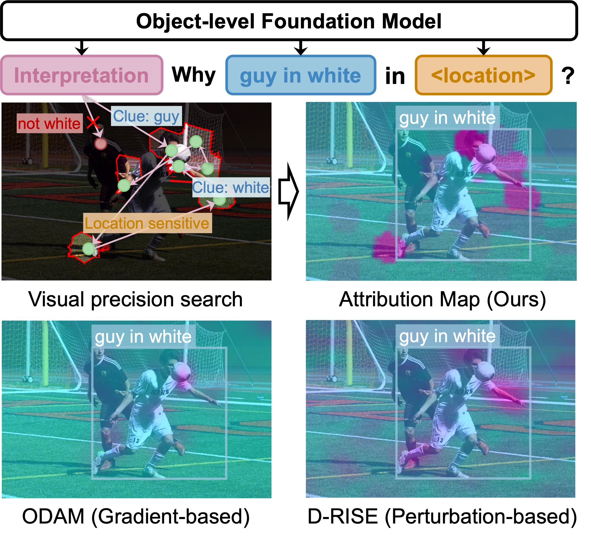
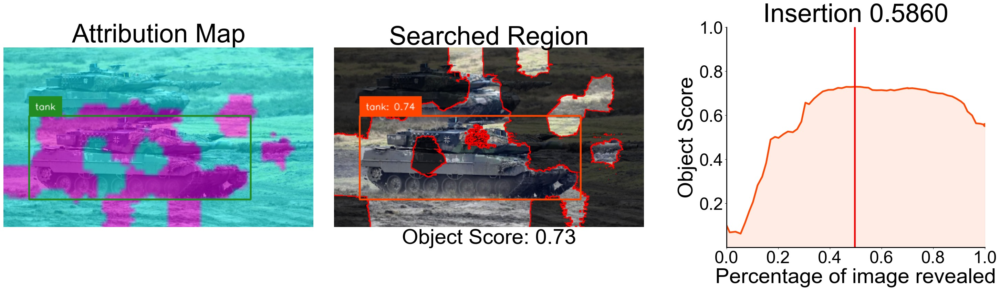
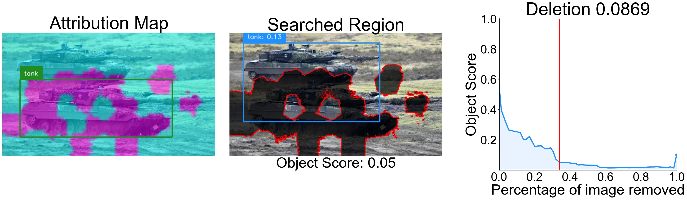
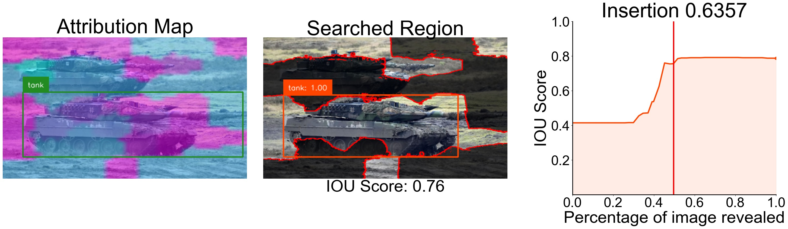
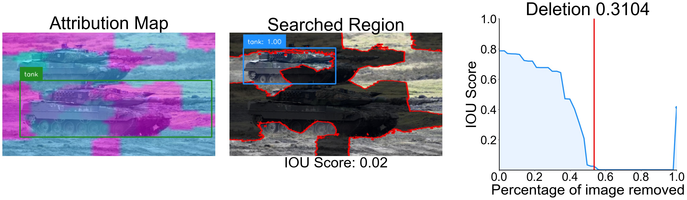

# Interpreting Object-level Foundation Models via Visual Precision Search

[](https://arxiv.org/abs/2411.16198)

<!--  -->

<p align = "center">

</p>

## 📰 News & Update

- **[2025.02.08]** We release the official code of VPS, a new interpretation mechanism.

- **[2024.09.30]** We begin to investigate the potential of interpretability in object detection.

## 🛠️ Environment

For our interpretation method, the packages we use are relatively common. Please mainly install `pytorch`, etc.

We provide code to explain Grounding DINO, but please install its dependencies first: [https://github.com/IDEA-Research/GroundingDINO](https://github.com/IDEA-Research/GroundingDINO).

For explaining Florence-2, please install its dependencies: [https://huggingface.co/microsoft/Florence-2-large-ft](https://huggingface.co/microsoft/Florence-2-large-ft)

For explaining traditional detectors, please install MMDetection v3.3: [https://github.com/open-mmlab/mmdetection/](https://github.com/open-mmlab/mmdetection)

In addition, please follow the [datasets/readme.md](datasets/readme.md) and [ckpt/readme.md](ckpt/readme.md) to organize the dataset and download the weights of the relevant detectors.

## 🧳 Quickly Try

You can experience the interpretability of a single image directly in the Jupyter notebook.

- Grounding DINO Interpretation (Detection): [tutorial](./tutorial/Grounding_DINO_explanation.ipynb)
- Florence-2 Interpretation (Detection): [tutorial](./tutorial/Florence-2_detection_explanation.ipynb)
- Florence-2 Interpretation (Visaul Grounding): [tutorial](./Florence-2_pharse_grounding_explanation.ipynb)

## 😮 Highlights

We provide some results of our approach on interpreting object detection models.

**Note:** The tank picture is from the Internet.

Grounding DINO:



Florence-2:



## 🗝️ How to Run

Prepare the datasets following [here](datasets/readme.md).

Download the benchmark files and put them into [./datasets](./datasets) from [https://huggingface.co/datasets/RuoyuChen/VPS_benchmark](https://huggingface.co/datasets/RuoyuChen/VPS_benchmark).

Run (more instructions are in fold [./scripts](./scripts/)):

```shell
./script/groundingdino_coco_correct.sh
```

Visualization:

```shell
python -m visualization.visualize_ours \
    --explanation-dir submodular_results/grounding-dino-coco-correctly/slico-1.0-1.0-division-number-100 \
    --Datasets datasets/coco/val2017
```

Evaluation faithfulness:

```shell
python -m evals.eval_AUC_faithfulness \
    --explanation-dir submodular_results/grounding-dino-coco-correctly/slico-1.0-1.0-division-number-100
```

Evaluation location:

```shell
python -m evals.eval_energy_pg \
    --Datasets datasets/coco/val2017 \
    --explanation-dir submodular_results/grounding-dino-coco-correctly/slico-1.0-1.0-division-number-100
```

## 👍 Acknowledgement

[SMDL-Attribution](https://github.com/RuoyuChen10/SMDL-Attribution): SOTA attribution method based on submodular subset selection

[Grounding DINO](https://github.com/IDEA-Research/GroundingDINO): an open-set object detector.

[Florence-2](https://huggingface.co/microsoft/Florence-2-large-ft): a novel vision foundation model with a unified, prompt-based representation for a variety of computer vision and vision-language tasks.

[MMDetection V3.3](https://github.com/open-mmlab/mmdetection): an open source object detection toolbox based on PyTorch.

## ✏️ Citation

```bibtex
@article{chen2024interpreting,
  title={Interpreting Object-level Foundation Models via Visual Precision Search},
  author={Chen, Ruoyu and Liang, Siyuan and Li, Jingzhi and Liu, Shiming and Li, Maosen and Huang, Zheng and Zhang, Hua and Cao, Xiaochun},
  journal={arXiv preprint arXiv:2411.16198},
  year={2024}
}
```