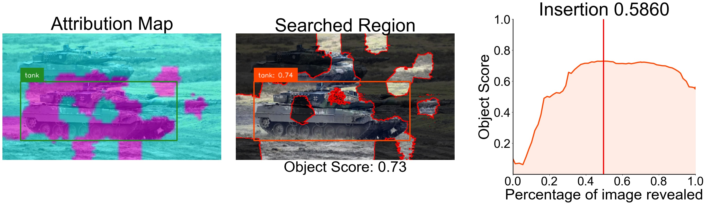
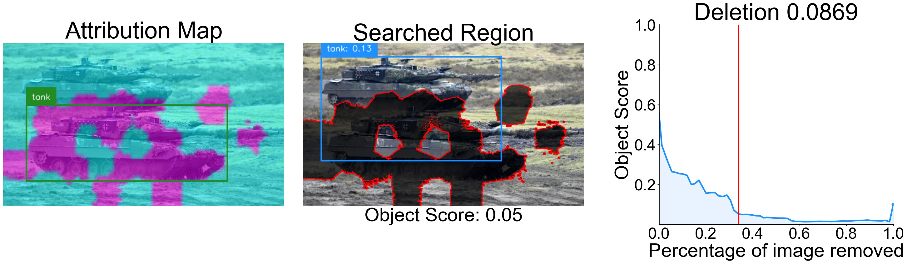

# Object Detection Interpretation

## 📰 News & Update

- **[2024.09.30]** We begin to investigate the potential of interpretability in object detection.

## 🛠️ Environment

For our interpretation method, the packages we use are relatively common. Please mainly install `pytorch`, etc.

We provide code to explain Grounding DINO, but please install its dependencies first: [https://github.com/IDEA-Research/GroundingDINO](https://github.com/IDEA-Research/GroundingDINO).

## 😮 Highlights

We provide some results of our approach on interpreting object detection models.

Grounding DINO:

## 👍 Acknowledgement

[SMDL-Attribution](https://github.com/RuoyuChen10/SMDL-Attribution): SOTA attribution method based on submodular subset selection

[Grounding DINO](https://github.com/IDEA-Research/GroundingDINO): an open-set object detector.